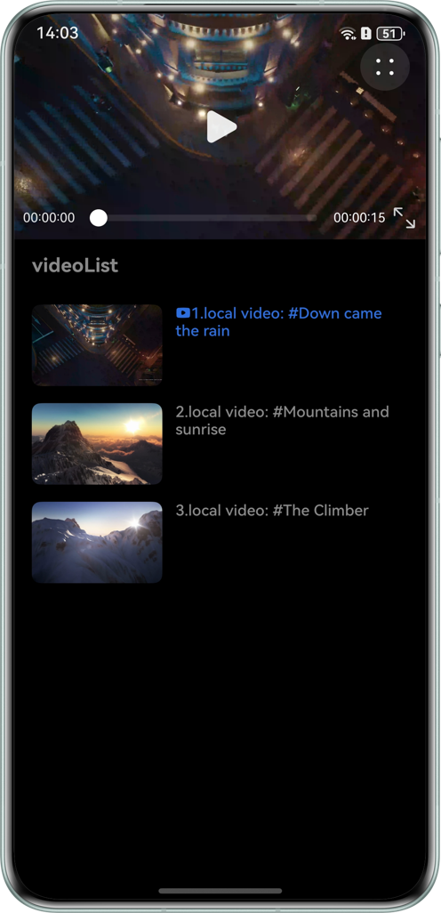
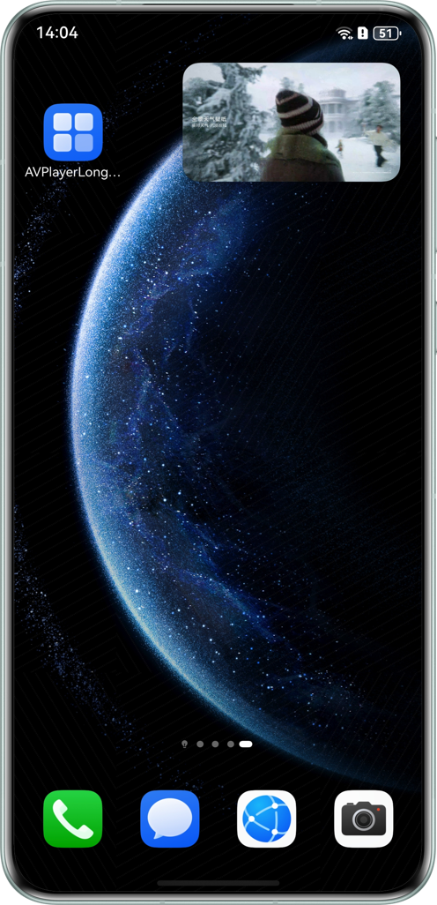
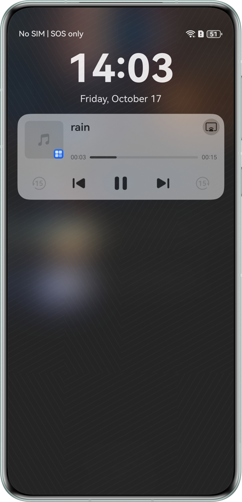
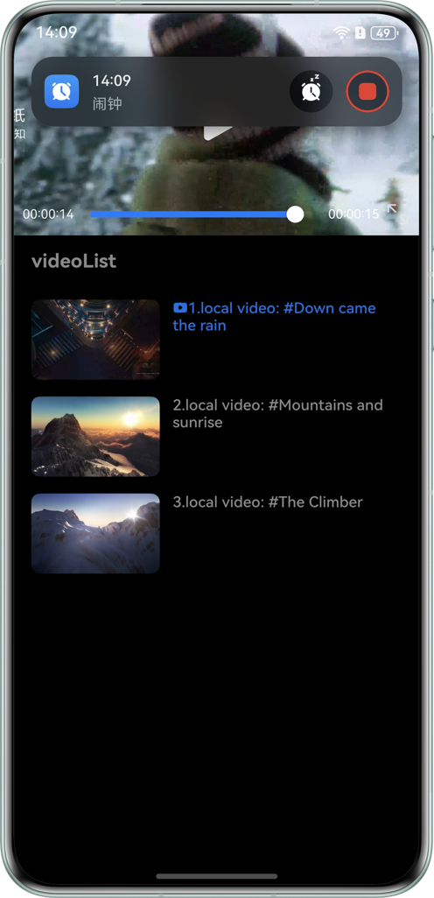
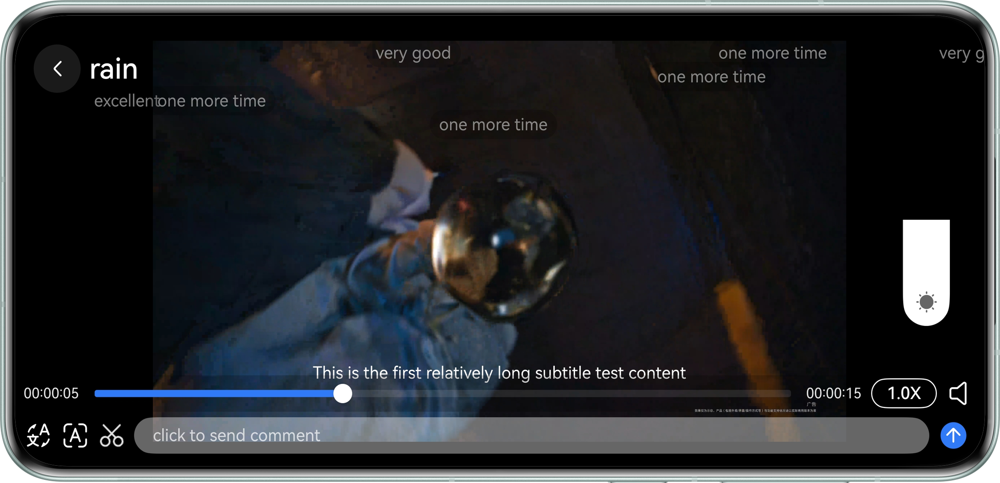
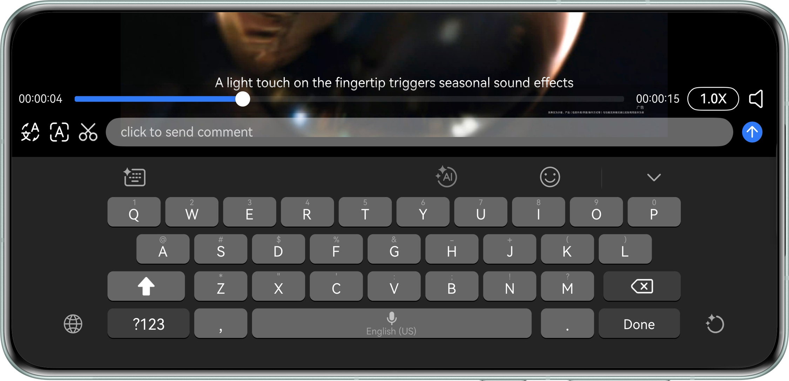
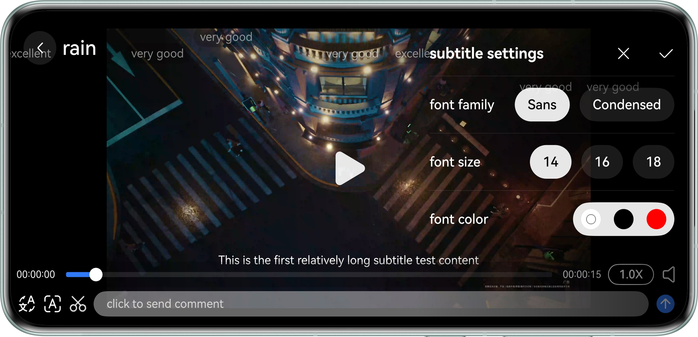
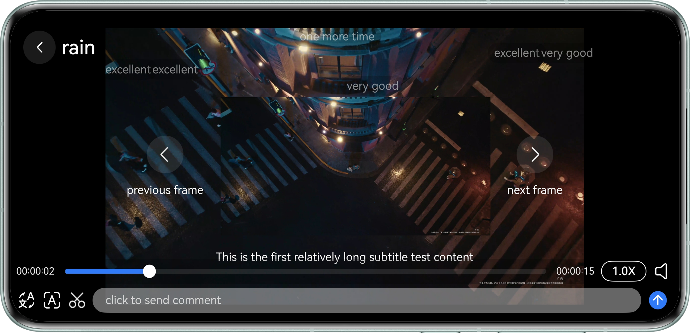

# Long Video Playback Using AVPlayer

## Overview

This sample demonstrates how to use AVPlayer to implement long video playback.

Features include basic playback control, brightness adjustment, focus management, foreground/background awareness, bullet comment sending and display, subtitle loading, video screenshot, Picture-in-Picture (PiP), and first-frame display.

## Effect

|                           Home Screen                           |                         PiP                         |                            Media Controller                             |                           Alarm Interruption                           |
|:--------------------------------------------------------:|:---------------------------------------------------:|:-----------------------------------------------------------:|:--------------------------------------------------------:|
|  |  |  |  |

|                           Landscape - Brightness Adjustment                           |                         Landscape - Bullet Comment Input                          |
|:--------------------------------------------------------:|:---------------------------------------------------:|
|  |  |

|                        Landscape - Subtitle Setting                         |                         Landscape - Screenshot                         |
|:-------------------------------------------------------:|:--------------------------------------------------------:|
|  |  |


## How to Use

1. Upon application launch, the video playlist and the first video's playback window appear, both displaying the video's first frame.

2. Switch between landscape and portrait modes by tapping the button or rotating your phone.

3. Incoming calls or alarms will automatically pause video playback; playback resumes once they end.

4. When Picture-in-Picture (PiP) mode is disabled, the video pauses if the application is backgrounded and resumes when the application returns to the foreground.

5. With PiP is enabled, the video continues playing in a PiP window even when the application is in the background.

6. In landscape mode: Swipe up/down on the left side of the screen to adjust volume, and on the right side to adjust brightness. You can also set playback speed and mute the video.

7. In landscape mode: Bullet comments appear at the top of the screen. Use the bottom toolbar to input and send comments.

8. In landscape mode: External subtitles are shown at the bottom of the screen. Tap the subtitle font settings button in the bottom toolbar to adjust the subtitle's font, size, and color.

9. In landscape mode: Tap the screenshot button in the bottom toolbar to capture the current video frame, which will display in the center of the screen. Use the previous frame/next frame buttons to fine-tune the frame.

10. You can control video playback (play/pause), progress adjustment, and track navigation (previous/next) via the Media Controller.

## Project Directory

```
├──entry/src/main/ets
│  ├──common
│  │  ├──constants
│  │  │  └──CommonConstants.ets         // Universal constants
│  │  └──utils
│  │     ├──BackgroundTaskManager.ets   // Background task related utility class
│  │     ├──ImageUtil.ets               // Image tool class
│  │     ├──Logger.ets                  // Log utility class
│  │     ├──TimeUtils.ets               // Time tool class
│  │     └──WindowUtil.ets              // Window tool class
│  ├──controller
│  │  ├──AvPlayerController.ets         // Avplayer public control class
│  │  ├──AvSessionController.ets        // Session public control class
│  │  └──PipWindowController.ets        // Picture-in-Picture public control class
│  ├──entryability
│  │  └──EntryAbility.ets               // Program entry
│  ├──model
│  │  ├──BulletCommentModel.ets         // bullet comment information entity class
│  │  ├──CaptionFontModel.ets           // Subtitle information entity class
│  │  ├──VideoData.ets                  // Video data entity class
│  │  └──VideoSourceModel.ets           // Video test data
│  ├──pages
│  │  └──IndexPage.ets                  // Home page
│  └──view
│     ├──AVPlayer.ets                   // Video playback component
│     ├──BulletCommentView.ets          // Bullet comment display component
│     ├──CaptionFontView.ets            // Subtitle font settings component
│     ├──LanguageDialog.ets             // Chinese and English subtitle switch component
│     ├──SpeedDialog.ets                // Double-speed playback component
│     ├──VideoList.ets                  // Video list component
│     ├──VideoSnapshotView.ets          // Video screenshot component
│     └──VolumeAndBrightnessView.ets    // Volume and brightness control component
└──src/main/resources                   // Application resource directory
```

## How to Implement

1. Use AVPlayer to implement basic video playback controls, including playback, seeking, speed adjustment, and subtitle loading. These core functionalities are encapsulated in AvPlayerController.

2. Use AVSession and BackgroundTaskManager to enable background video playback and control via the Media Controller. The core functionalities are encapsulated in AvSessionController and BackgroundTaskManager.

3. Use PiPWindow to keep the video playing in a PiP window when the application returns to the home screen. These core functionalities are encapsulated in PiPWindowController.

4. Use other encapsulated utilities to retrieve the first frame of the video, convert time, and control the window. 

## Required Permissions

1. ohos.permission.KEEP_BACKGROUND_RUNNING: allows an application to run in the background.

## Constraints

1. This sample is only supported on Huawei phones running standard systems.

2. The HarmonyOS version must be HarmonyOS 5.1.0 Release or later.

3. The DevEco Studio version must be DevEco Studio 5.1.0 Release or later.

4. The HarmonyOS SDK version must be HarmonyOS 5.1.0 Release SDK or later.
